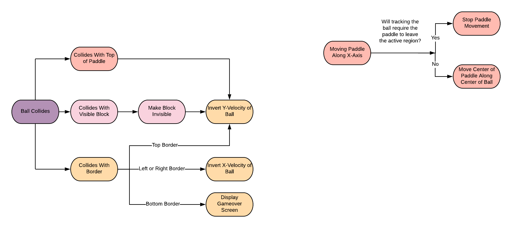
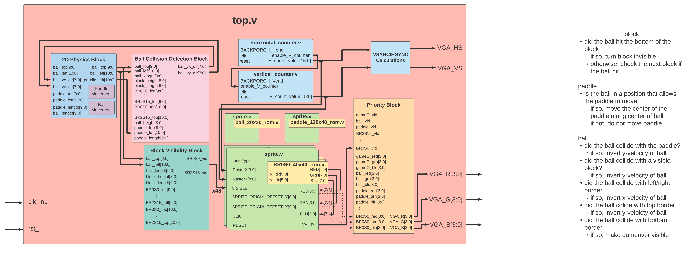
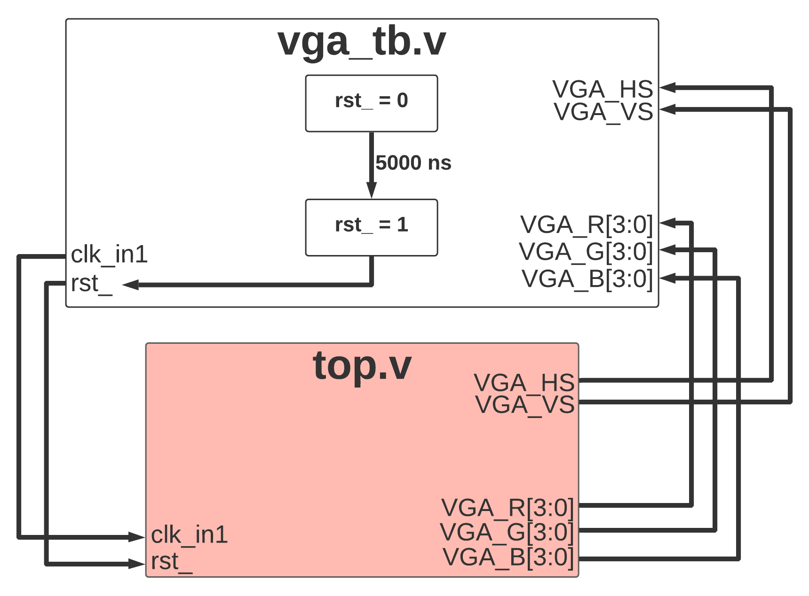

# VGA Breakout Game

Breakout Game designed and tested with Nexys4 DDR Artix-7 FPGA board with VGA connection.

# Ball and Paddle Logic

# System Architecture

# Testbench

# Demo

Demo video shown [here](https://drive.google.com/file/d/1aeRm9rE-aHocfAg3wm0zTYnZ97LKiD3V/view?usp=sharing).